# 👋 Hello, World! I'm Walt

<div align="center">




📍 Shanghai, China | 🌏 Exploring Data Science

---

## 🎯 About Me

```java
public class Walt {
    private String location = "Shanghai";
    private String role = "Java Programmer";
    private String passion = "Data Science";
    private String[] hobbies = {"Gaming", "Movies", "Food"};
    
    public void introduce() {
        System.out.println("Living the dream, one line of code at a time!");
    }
}
```

## 🚀 What Drives Me

| Aspect | Description |
|--------|-------------|
| 🏙️ **Base** | Currently coding & growing in the vibrant city of Shanghai |
| 💻 **Day Job** | Crafting robust Java applications |
| 📊 **Dream Path** | Transitioning into Data Science & ML |
| 🧠 **Superpower** | Cinematic memory - I quote movies like others breathe |
| 🎮 **Escape** | Gaming enthusiast (when deadlines allow!) |

## 🌟 Personal Philosophy

> *"I'm comfortably lazy - aspiring to learn while mastering the art of energy conservation. Love delicious food, but delivery apps are my best friends."*

### Core Values
- ✅ **Authenticity**: Lying gives me anxiety, so truth is my default mode
- ❤️ **Family First**: My parents and wife are my universe
- 🤝 **Connection**: Always open to making new friends and collaborators
- 🎬 **Movie Buff**: Catch me referencing classic film dialogues randomly

## 🛠️ Tech Stack & Interests

<table>
  <tr>
    <td align="center" width="16%">
      <br/>
      <sub><b>Java</b></sub>
    </td>
    <td align="center" width="16%">
      <br/>
      <sub><b>Spring</b></sub>
    </td>
    <td align="center" width="16%">
      <br/>
      <sub><b>Python</b></sub>
    </td>
    <td align="center" width="16%">
      <br/>
      <sub><b>Pandas</b></sub>
    </td>
    <td align="center" width="16%">
      <br/>
      <sub><b>Docker</b></sub>
    </td>
    <td align="center" width="16%">
      <br/>
      <sub><b>Git</b></sub>
    </td>
  </tr>
</table>

<p align="center">
  <strong>Current:</strong> Java | Spring | Backend Development<br><br>
  <strong>Learning:</strong> Python | Pandas | Machine Learning | Data Visualization<br><br>
  <strong>Exploring:</strong> AI/ML | Big Data | Cloud Technologies
</p>

## 📊 GitHub Activity

<div align="center">
  
  
</div>

## 📬 Let's Connect

Whether you want to discuss:
- 🖥️ Java best practices
- 📈 Data Science journey
- 🎮 Gaming recommendations
- 🎬 Movie quotes competition
- 🍜 Best food delivery spots in Shanghai

**Feel free to reach out!** Let's build something amazing together.

---

<div align="center">

*Currently: Coding by day, dreaming of data by night* 🌙

Made with ☕ and ❤️

</div>
